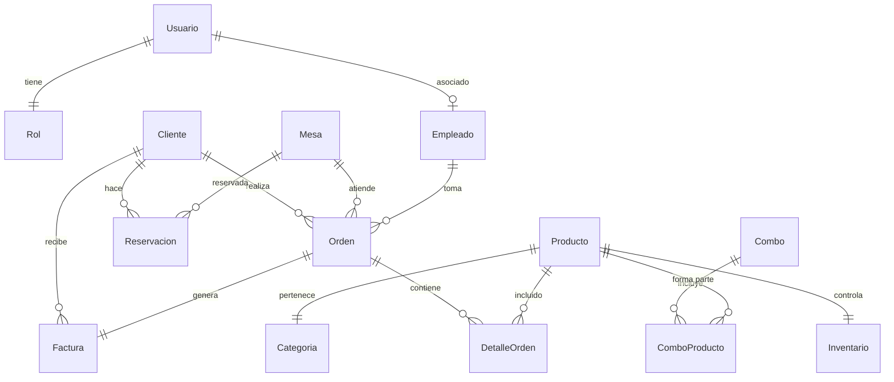

```mermaid
graph TB
    subgraph "Frontend Layer"
        UI[React Frontend]
    end

    subgraph "API Layer"
        AUTH[Authentication Controller]
        ORDEN[Orden Controller]
        FACTURA[Factura Controller]
        MESA[Mesa Controller]
        RESERVA[Reservacion Controller]
        CLIENTE[Cliente Controller]
        PRODUCTO[Producto Controller]
        INVENTARIO[Inventario Controller]
        REPORTE[Reporte Controller]
        EMPLEADO[Empleado Controller]
    end

    subgraph "Business Logic Layer"
        AUTHSRV[Auth Service]
        ORDENSRV[Orden Service]
        FACTURASRV[Factura Service]
        MESASRV[Mesa Service]
        RESERVASRV[Reservacion Service]
        PRODUCTOSRV[Producto Service]
        REPORTESRV[Reporte Service]
        EMAILSRV[Email Service]
    end

    subgraph "Data Access Layer"
        AUTHREPO[Usuario Repository]
        ORDENREPO[Orden Repository]
        FACTURAREPO[Factura Repository]
        MESAREPO[Mesa Repository]
        RESERVAREPO[Reservacion Repository]
        PRODUCTOREPO[Producto Repository]
        REPORTEREPO[Reporte Repository]
        CLIENTEREPO[Cliente Repository]
        EMPLEADOREPO[Empleado Repository]
        INVENTARIOREPO[Inventario Repository]
    end

    subgraph "Database Layer"
        DB[(SQL Server Database)]
    end

    UI --> AUTH
    UI --> ORDEN
    UI --> FACTURA
    UI --> MESA
    UI --> RESERVA
    UI --> CLIENTE
    UI --> PRODUCTO
    UI --> INVENTARIO
    UI --> REPORTE
    UI --> EMPLEADO

    AUTH --> AUTHSRV
    ORDEN --> ORDENSRV
    FACTURA --> FACTURASRV
    MESA --> MESASRV
    RESERVA --> RESERVASRV
    PRODUCTO --> PRODUCTOSRV
    REPORTE --> REPORTESRV

    AUTHSRV --> AUTHREPO
    ORDENSRV --> ORDENREPO
    FACTURASRV --> FACTURAREPO
    MESASRV --> MESAREPO
    RESERVASRV --> RESERVAREPO
    PRODUCTOSRV --> PRODUCTOREPO
    REPORTEREPO --> REPORTEREPO

    AUTHREPO --> DB
    ORDENREPO --> DB
    FACTURAREPO --> DB
    MESAREPO --> DB
    RESERVAREPO --> DB
    PRODUCTOREPO --> DB
    REPORTEREPO --> DB
    CLIENTEREPO --> DB
    EMPLEADOREPO --> DB
    INVENTARIOREPO --> DB

    ORDENSRV --> EMAILSRV
    FACTURASRV --> EMAILSRV
    RESERVASRV --> EMAILSRV
```

# 🇩🇴 El Criollo - Sistema POS para Restaurante Dominicano


## 🍽️ Descripción del Proyecto

**El Criollo** es un sistema POS (Point of Sale) completo y moderno diseñado específicamente para restaurantes dominicanos. El sistema combina la autenticidad de la gastronomía dominicana con tecnología de vanguardia, ofreciendo una solución integral para la gestión de restaurantes con enfoque cultural específico.

### ✨ Características Principales

- 🇩🇴 **Especialización Dominicana**: Menú auténtico con 37+ productos típicos dominicanos
- 💰 **Facturación con ITBIS**: Cálculo automático del 18% de ITBIS (impuesto dominicano)
- 🔐 **Sistema de Roles**: 4 roles específicos (Administrador, Mesero, Cajero, Recepción)
- 📱 **API REST Completa**: 60+ endpoints documentados con Swagger
- 🧪 **Testing Integral**: 23 pruebas secuenciales que simulan un día completo
- 📊 **Dashboard y Reportes**: Analytics en tiempo real y reportes gerenciales
- 🏪 **Gestión 360°**: Inventario, mesas, reservas, órdenes, facturación

## 🏗️ Arquitectura del Sistema



## 🛠️ Stack Tecnológico

| Componente        | Tecnología            | Versión | Descripción                     |
| ----------------- | --------------------- | ------- | ------------------------------- |
| **Backend**       | .NET Core             | 8.0     | Framework principal de la API   |
| **Base de Datos** | SQL Server            | 2022+   | Motor de base de datos          |
| **ORM**           | Entity Framework Core | 8.0     | Mapeo objeto-relacional         |
| **Autenticación** | JWT Bearer            | 8.0     | Tokens de autenticación         |
| **Hashing**       | BCrypt.Net            | 4.0.3   | Encriptación de contraseñas     |
| **Mapeo**         | AutoMapper            | 12.0.1  | Mapeo entre DTOs y entidades    |
| **Logging**       | Serilog               | 8.0     | Sistema de logs avanzado        |
| **Email**         | MailKit               | 4.3.0   | Servicio de correo electrónico  |
| **Documentación** | Swagger/OpenAPI       | 6.5.0   | Documentación automática de API |
| **Testing**       | xUnit                 | 2.4.2   | Framework de pruebas            |
| **Validación**    | FluentValidation      | 11.8.1  | Validación de modelos           |

## 🗄️ Modelo de Base de Datos

### 📊 Entidades Principales

| Entidad         | Descripción              | Campos Clave                                            | Relaciones                        |
| --------------- | ------------------------ | ------------------------------------------------------- | --------------------------------- |
| **Usuario**     | Sistema de autenticación | `UsuarioID`, `UsuarioNombre`, `ContrasenaHash`, `RolID` | → Rol, → Empleado                 |
| **Empleado**    | Información de empleados | `EmpleadoID`, `Cedula`, `Nombre`, `Salario`             | → Usuario                         |
| **Cliente**     | Datos de clientes        | `ClienteID`, `Cedula`, `Telefono`, `PreferenciasComida` | → Ordenes, → Reservaciones        |
| **Mesa**        | Mesas del restaurante    | `MesaID`, `NumeroMesa`, `Capacidad`, `Estado`           | → Ordenes, → Reservaciones        |
| **Producto**    | Menú dominicano          | `ProductoID`, `Nombre`, `Precio`, `TiempoPreparacion`   | → Categoria, → Inventario         |
| **Orden**       | Órdenes/comandas         | `OrdenID`, `NumeroOrden`, `Estado`, `TipoOrden`         | → Mesa, → Cliente, → DetalleOrden |
| **Factura**     | Facturación con ITBIS    | `FacturaID`, `NumeroFactura`, `Subtotal`, `Impuesto`    | → Orden, → Cliente                |
| **Inventario**  | Control de stock         | `InventarioID`, `CantidadDisponible`, `CantidadMinima`  | → Producto                        |
| **Reservacion** | Sistema de reservas      | `ReservacionID`, `FechaYHora`, `CantidadPersonas`       | → Mesa, → Cliente                 |

### 🔗 Diagrama de Relaciones



## 🍽️ Menú Dominicano Implementado

### 🥘 Categorías y Productos (37+ items auténticos)

| Categoría              | Cantidad | Productos Destacados                               | Precio Promedio |
| ---------------------- | -------- | -------------------------------------------------- | --------------- |
| **Platos Principales** | 6        | Pollo Guisado, Pernil al Horno, Rabo Encendido     | RD$ 420         |
| **Acompañamientos**    | 6        | Arroz Blanco, Habichuelas Rojas, Moro de Guandules | RD$ 95          |
| **Frituras**           | 6        | Tostones, Yuca Frita, Maduros, Chicharrones        | RD$ 97          |
| **Bebidas**            | 6        | Morir Soñando, Jugo de Chinola, Mamajuana          | RD$ 127         |
| **Postres**            | 5        | Tres Leches, Flan de Coco, Majarete                | RD$ 146         |
| **Desayunos**          | 5        | Mangú, Tres Golpes, Huevos Rancheros               | RD$ 156         |
| **Sopas**              | 4        | Sancocho, Mondongo, Sopa de Pollo                  | RD$ 263         |
| **Mariscos**           | 5        | Pescao Frito, Camarones al Ajillo, Pulpo Guisado   | RD$ 436         |

### 🍴 Combos Especiales Dominicanos

1. **🇩🇴 La Bandera Dominicana** - RD$ 480

   - Arroz blanco, habichuelas rojas, pollo guisado y ensalada
   - _El plato más típico de República Dominicana_

2. **🏝️ Combo Criollo Especial** - RD$ 550

   - Pernil al horno, moro de guandules, tostones y jugo natural

3. **🌅 Desayuno Típico Dominicano** - RD$ 320

   - Tres golpes completo, avena caliente y jugo de chinola

4. **👨‍👩‍👧‍👦 Parrillada Familiar** - RD$ 1,200

   - Costillas BBQ, chicharrones, yuca frita, tostones (4 personas)

5. **🐟 Combo Marino Criollo** - RD$ 520

   - Pescao frito, arroz blanco, ensalada verde y maduros

6. **🥗 Combo Vegetariano** - RD$ 280
   - Moro de guandules, yuca hervida, ensalada verde y jugo natural

## 🔐 Sistema de Autenticación y Roles

### 👥 Roles Implementados

| Rol                  | Permisos                       | Funcionalidades Principales                             |
| -------------------- | ------------------------------ | ------------------------------------------------------- |
| **🔑 Administrador** | Control total del sistema      | Gestión de usuarios, reportes, configuración, auditoría |
| **📞 Recepción**     | Reservas y atención al cliente | Crear reservas, gestionar mesas, registrar clientes     |
| **🍽️ Mesero**        | Órdenes y servicio             | Tomar órdenes, actualizar estados, gestionar mesas      |
| **💰 Cajero**        | Facturación y pagos            | Procesar pagos, generar facturas, manejar caja          |

### 🔑 Credenciales por Defecto

```json
{
  "administrador": {
    "username": "thecuevas0123_",
    "password": "thepikachu0123_",
    "email": "josejoga.opx@gmail.com"
  }
}
```

### 🛡️ Características de Seguridad

- ✅ **JWT Authentication** con refresh tokens (60 min + 7 días)
- ✅ **Hashing BCrypt** para contraseñas seguras
- ✅ **Autorización basada en roles** con políticas específicas
- ✅ **Validación de entrada** en todos los endpoints
- ✅ **Middleware de manejo de errores** centralizado
- ✅ **Rate limiting** configurable
- ✅ **CORS** configurado para múltiples orígenes
- ✅ **Health checks** para monitoreo del sistema

## 📊 API Endpoints

### 🔗 Grupos de Endpoints Principales

| Grupo             | Base URL           | Endpoints    | Descripción                                          |
| ----------------- | ------------------ | ------------ | ---------------------------------------------------- |
| **🔐 Auth**       | `/api/auth`        | 8 endpoints  | Login, registro, refresh tokens, gestión de usuarios |
| **🍽️ Órdenes**    | `/api/orden`       | 12 endpoints | Gestión completa de órdenes y comandas               |
| **🪑 Mesas**      | `/api/mesas`       | 6 endpoints  | Estado y gestión de mesas del restaurante            |
| **🥘 Productos**  | `/api/productos`   | 15 endpoints | Menú, productos, categorías y combos                 |
| **💰 Facturas**   | `/api/factura`     | 10 endpoints | Facturación con ITBIS dominicano                     |
| **📦 Inventario** | `/api/inventario`  | 8 endpoints  | Control de stock y movimientos                       |
| **📅 Reservas**   | `/api/reservacion` | 9 endpoints  | Sistema completo de reservaciones                    |
| **📊 Reportes**   | `/api/reporte`     | 7 endpoints  | Analytics, dashboard y reportes gerenciales          |
| **👤 Clientes**   | `/api/cliente`     | 6 endpoints  | Gestión de clientes y fidelización                   |
| **👨‍💼 Empleados**  | `/api/empleado`    | 5 endpoints  | Gestión de empleados y nómina                        |

### 📝 Ejemplos de Uso de la API

#### 🔐 Autenticación

```http
POST /api/auth/login
Content-Type: application/json

{
  "username": "thecuevas0123_",
  "password": "thepikachu0123_",
  "recordarSesion": true
}
```

#### 🍽️ Crear una Orden

```http
POST /api/orden
Authorization: Bearer {token}
Content-Type: application/json

{
  "mesaId": 1,
  "clienteId": 5,
  "tipoOrden": "Mesa",
  "observaciones": "Sin picante, cliente alérgico",
  "items": [
    {
      "productoId": 1,
      "cantidad": 2,
      "notasEspeciales": "Pollo bien cocido"
    },
    {
      "productoId": 7,
      "cantidad": 2,
      "notasEspeciales": "Arroz sin sal"
    }
  ]
}
```

#### 💰 Generar Factura con ITBIS

```http
POST /api/factura
Authorization: Bearer {token}
Content-Type: application/json

{
  "ordenId": 123,
  "metodoPago": "Tarjeta",
  "descuento": 50.00,
  "propina": 100.00,
  "observaciones": "Cliente frecuente - descuento aplicado"
}
```

#### 📅 Crear Reservación

```http
POST /api/reservacion
Authorization: Bearer {token}
Content-Type: application/json

{
  "mesaId": 4,
  "clienteId": 10,
  "cantidadPersonas": 6,
  "fechaHora": "2024-12-25T19:00:00",
  "duracionMinutos": 120,
  "notasEspeciales": "Cena de Navidad - mesa decorada"
}
```

## 🧪 Sistema de Pruebas

### 🎯 Suite de Pruebas de Integración

El sistema incluye una **suite completa de 23 pruebas secuenciales** que simula un día completo de operaciones:

#### 📋 Flujo de Pruebas Completo

| Fase                          | Tests | Descripción                                | Cobertura             |
| ----------------------------- | ----- | ------------------------------------------ | --------------------- |
| **🔐 Autenticación**          | 1-2   | Login admin y verificación de sistema      | Seguridad básica      |
| **👥 Gestión de Usuarios**    | 3-6   | Crear usuarios, cambiar contraseñas, roles | Sistema de usuarios   |
| **🏪 Gestión de Restaurante** | 7-9   | Mesas, inventario, movimientos             | Infraestructura       |
| **👤 Gestión de Clientes**    | 10    | Registro de clientes dominicanos           | CRM                   |
| **📅 Sistema de Reservas**    | 11-13 | Crear, consultar, confirmar reservas       | Reservaciones         |
| **🍽️ Gestión de Órdenes**     | 14-17 | Crear órdenes, agregar items, estados      | Operaciones           |
| **💰 Facturación**            | 18-20 | Generar facturas, ITBIS, pagos             | Facturación           |
| **📊 Reportes**               | 21-22 | Analytics, dashboard, métricas             | Business Intelligence |
| **🏁 Cierre**                 | 23    | Validación final del día                   | Cierre operativo      |

### 🚀 Ejecutar las Pruebas

```bash
# Navegar al directorio de pruebas
cd src/ElCriollo.API.Tests

# Restaurar dependencias
dotnet restore

# Ejecutar todas las pruebas
dotnet test --logger "console;verbosity=detailed"

# Ejecutar solo el flujo completo
dotnet test --filter "FlujoCotidiano_SimulacionCompleta_DebeCompletarExitosamente"

# Generar reporte de cobertura
dotnet test --collect:"XPlat Code Coverage"
```

### ✅ Validaciones Específicas Dominicanas

- **📱 Teléfonos**: Validación de números dominicanos (809/829/849-XXX-XXXX)
- **🆔 Cédulas**: Formato dominicano (XXX-XXXXXXX-X)
- **💰 ITBIS**: Cálculo correcto del 18% de impuesto
- **🏦 Facturación**: Numeración fiscal dominicana
- **🍽️ Menú**: Validación de productos auténticos dominicanos

## 💰 Sistema de Facturación Dominicana

### 🧾 Características del ITBIS

- **📊 Tasa de Impuesto**: 18% (ITBIS República Dominicana)
- **🔢 Numeración**: FACT-YYYYMMDD-#### (automática)
- **💳 Métodos de Pago**: Efectivo, Tarjeta, Transferencia
- **📧 Notificaciones**: Email automático al cliente
- **📋 Comprobantes**: Formato fiscal dominicano

### 💸 Ejemplo de Cálculo

```
Subtotal:          RD$ 1,000.00
ITBIS (18%):       RD$   180.00
Descuento:         RD$    50.00
Propina:           RD$   100.00
─────────────────────────────────
TOTAL:             RD$ 1,230.00
```

## 📊 Dashboard y Reportes

### 📈 Métricas del Dashboard

- **💰 Ventas del Día**: Ingresos actuales vs objetivo
- **🍽️ Órdenes Activas**: Estado en tiempo real
- **🪑 Ocupación de Mesas**: Disponibilidad actual
- **👥 Clientes Únicos**: Flujo diario de clientes
- **📅 Reservaciones**: Programación del día
- **📦 Stock Bajo**: Alertas de inventario
- **📊 Tendencias**: Gráficos por hora

### 📋 Tipos de Reportes

1. **📊 Ventas Diarias**: Análisis detallado de ingresos
2. **🥘 Productos Más Vendidos**: Top 10 del menú
3. **👤 Análisis de Clientes**: Comportamiento y preferencias
4. **📦 Movimientos de Inventario**: Entradas y salidas
5. **👨‍💼 Productividad de Empleados**: Rendimiento por mesero
6. **🇩🇴 Comida Dominicana**: Análisis de autenticidad cultural

## 🚀 Instalación y Configuración

### 📋 Requisitos Previos

- ✅ **.NET 8.0 SDK** o superior
- ✅ **SQL Server 2019+** (LocalDB o instancia completa)
- ✅ **Visual Studio 2022** o **VS Code**
- ✅ **Git** para control de versiones

### 🔧 Configuración Paso a Paso

#### 1. Clonar el Repositorio

```bash
git clone https://github.com/tu-usuario/elcriollo-restaurant.git
cd elcriollo-restaurant
```

#### 2. Configurar Base de Datos

```bash
# Crear base de datos
sqlcmd -S localhost -Q "CREATE DATABASE ElCriolloRestaurante"

# Ejecutar script de inicialización
sqlcmd -S localhost -d ElCriolloRestaurante -i elcriollo.sql
```

#### 3. Configurar appsettings.json

```json
{
  "ConnectionStrings": {
    "DefaultConnection": "Server=localhost;Database=ElCriolloRestaurante;Trusted_Connection=true;"
  },
  "JwtSettings": {
    "SecretKey": "ElCriollo2024_RestauranteDominicano_SecretKey_SuperSecure_MinimumOf32Characters!",
    "Issuer": "ElCriolloAPI",
    "Audience": "ElCriolloClients",
    "ExpiryInMinutes": 60
  },
  "EmailSettings": {
    "SmtpServer": "smtp.gmail.com",
    "SmtpPort": 587,
    "FromEmail": "tu-email@gmail.com",
    "Username": "tu-username",
    "Password": "tu-password"
  }
}
```

#### 4. Ejecutar la Aplicación

```bash
# Navegar al proyecto API
cd src/ElCriollo.API

# Restaurar paquetes
dotnet restore

# Ejecutar en modo desarrollo
dotnet run

# La API estará disponible en:
# https://localhost:7001
# http://localhost:5001
```

#### 5. Acceder a la Documentación

- **🌐 Swagger UI**: `https://localhost:7001/`
- **📊 Health Check**: `https://localhost:7001/health`
- **🔐 Login**: `POST https://localhost:7001/api/auth/login`

### 🐳 Configuración con Docker

```dockerfile
# Dockerfile para El Criollo API
FROM mcr.microsoft.com/dotnet/aspnet:8.0 AS base
WORKDIR /app
EXPOSE 80
EXPOSE 443

FROM mcr.microsoft.com/dotnet/sdk:8.0 AS build
WORKDIR /src
COPY ["src/ElCriollo.API/ElCriollo.Api.csproj", "src/ElCriollo.API/"]
RUN dotnet restore "src/ElCriollo.API/ElCriollo.Api.csproj"
COPY . .
WORKDIR "/src/src/ElCriollo.API"
RUN dotnet build "ElCriollo.Api.csproj" -c Release -o /app/build

FROM build AS publish
RUN dotnet publish "ElCriollo.Api.csproj" -c Release -o /app/publish

FROM base AS final
WORKDIR /app
COPY --from=publish /app/publish .
ENTRYPOINT ["dotnet", "ElCriollo.Api.dll"]
```

```yaml
# docker-compose.yml
version: "3.8"
services:
  elcriollo-api:
    build: .
    ports:
      - "5001:80"
      - "7001:443"
    environment:
      - ASPNETCORE_ENVIRONMENT=Production
      - ConnectionStrings__DefaultConnection=Server=sql-server;Database=ElCriolloRestaurante;User=sa;Password=YourPassword123!
    depends_on:
      - sql-server

  sql-server:
    image: mcr.microsoft.com/mssql/server:2022-latest
    environment:
      - ACCEPT_EULA=Y
      - SA_PASSWORD=YourPassword123!
    ports:
      - "1433:1433"
    volumes:
      - sql-data:/var/opt/mssql

volumes:
  sql-data:
```

## 📁 Estructura del Proyecto

```
elcriollo-restaurant/
├── 📄 README.md                           # Documentación principal
├── 📄 elcriollo.sql                       # Script de base de datos
├── 📄 ElCriollo.sln                       # Solución de Visual Studio
├──
├── 📁 src/
│   ├── 📁 ElCriollo.API/                  # Proyecto principal de la API
│   │   ├── 📁 Controllers/                # Controladores REST
│   │   │   ├── 🔐 AuthController.cs       # Autenticación y usuarios
│   │   │   ├── 🍽️ OrdenController.cs      # Gestión de órdenes
│   │   │   ├── 💰 FacturaController.cs    # Facturación con ITBIS
│   │   │   ├── 🪑 MesasController.cs      # Gestión de mesas
│   │   │   ├── 📅 ReservacionController.cs # Sistema de reservas
│   │   │   ├── 👤 ClienteController.cs    # Gestión de clientes
│   │   │   ├── 🥘 ProductosController.cs  # Menú y productos
│   │   │   ├── 📦 InventarioController.cs # Control de inventario
│   │   │   ├── 📊 ReporteController.cs    # Reportes y analytics
│   │   │   └── 👨‍💼 EmpleadoController.cs  # Gestión de empleados
│   │   │
│   │   ├── 📁 Services/                   # Lógica de negocio
│   │   │   ├── 🔐 AuthService.cs          # Servicio de autenticación
│   │   │   ├── 🍽️ OrdenService.cs         # Lógica de órdenes
│   │   │   ├── 💰 FacturaService.cs       # Lógica de facturación
│   │   │   ├── 📅 ReservacionService.cs   # Lógica de reservas
│   │   │   ├── 🥘 ProductoService.cs      # Lógica de productos
│   │   │   ├── 📊 ReporteService.cs       # Lógica de reportes
│   │   │   ├── 📧 EmailService.cs         # Servicio de email
│   │   │   └── 🪑 MesaService.cs          # Lógica de mesas
│   │   │
│   │   ├── 📁 Repositories/               # Acceso a datos
│   │   │   ├── 🔄 BaseRepository.cs       # Repositorio base
│   │   │   ├── 👤 UsuarioRepository.cs    # Datos de usuarios
│   │   │   ├── 🍽️ OrdenRepository.cs      # Datos de órdenes
│   │   │   ├── 💰 FacturaRepository.cs    # Datos de facturas
│   │   │   ├── 📅 ReservacionRepository.cs # Datos de reservas
│   │   │   ├── 🥘 ProductoRepository.cs   # Datos de productos
│   │   │   ├── 📊 ReporteRepository.cs    # Datos para reportes
│   │   │   ├── 👤 ClienteRepository.cs    # Datos de clientes
│   │   │   ├── 👨‍💼 EmpleadoRepository.cs  # Datos de empleados
│   │   │   ├── 📦 InventarioRepository.cs # Datos de inventario
│   │   │   └── 🪑 MesaRepository.cs       # Datos de mesas
│   │   │
│   │   ├── 📁 Models/                     # Modelos de datos
│   │   │   ├── 📁 Entities/               # Entidades de base de datos
│   │   │   │   ├── 👤 Usuario.cs          # Entidad Usuario
│   │   │   │   ├── 👨‍💼 Empleado.cs        # Entidad Empleado
│   │   │   │   ├── 👤 Cliente.cs          # Entidad Cliente
│   │   │   │   ├── 🪑 Mesa.cs             # Entidad Mesa
│   │   │   │   ├── 🍽️ Orden.cs            # Entidad Orden
│   │   │   │   ├── 🥘 Producto.cs         # Entidad Producto
│   │   │   │   ├── 💰 Factura.cs          # Entidad Factura
│   │   │   │   ├── 📦 Inventario.cs       # Entidad Inventario
│   │   │   │   ├── 📅 Reservacion.cs      # Entidad Reservacion
│   │   │   │   └── 🎭 Rol.cs              # Entidad Rol
│   │   │   │
│   │   │   ├── 📁 DTOs/                   # Objetos de transferencia
│   │   │   │   ├── 📁 Request/            # DTOs de entrada
│   │   │   │   └── 📁 Response/           # DTOs de salida
│   │   │   │
│   │   │   └── 📁 ViewModels/             # Modelos para vistas
│   │   │
│   │   ├── 📁 Data/                       # Contexto de base de datos
│   │   │   └── 🗄️ ElCriolloDbContext.cs   # Contexto principal
│   │   │
│   │   ├── 📁 Configuration/              # Configuraciones
│   │   │   ├── ⚙️ JwtSettings.cs          # Configuración JWT
│   │   │   └── 📧 EmailSettings.cs        # Configuración Email
│   │   │
│   │   ├── 📁 Middleware/                 # Middleware personalizado
│   │   │   └── 🛡️ ErrorHandlingMiddleware.cs # Manejo de errores
│   │   │
│   │   ├── 📁 Helpers/                    # Utilidades
│   │   │   └── 🔄 AutoMapperProfile.cs    # Configuración AutoMapper
│   │   │
│   │   ├── 📄 Program.cs                  # Punto de entrada
│   │   ├── 📄 appsettings.json           # Configuración principal
│   │   └── 📄 ElCriollo.Api.csproj       # Archivo de proyecto
│   │
│   └── 📁 ElCriollo.API.Tests/           # Proyecto de pruebas
│       ├── 📁 Integration/               # Pruebas de integración
│       │   ├── 🧪 ElCriolloIntegrationTests.cs # Pruebas principales
│       │   ├── 🏭 TestWebApplicationFactory.cs # Factory de pruebas
│       │   ├── 📊 TestResponseModels.cs   # Modelos para pruebas
│       │   └── 🌱 TestDataSeeder.cs       # Datos de prueba
│       │
│       ├── 📄 setup-test-db.sql          # Script para BD de pruebas
│       ├── 📄 README.md                  # Documentación de pruebas
│       └── 📄 ElCriollo.API.Tests.csproj # Proyecto de pruebas
```

## 🌟 Características Dominicanas Específicas

### 🇩🇴 Adaptaciones Culturales

- **🍽️ Menú Auténtico**: 37+ productos tradicionales dominicanos
- **💰 Moneda Local**: Precios en pesos dominicanos (RD$)
- **🏦 ITBIS**: Cálculo automático del 18% de impuesto
- **📱 Teléfonos**: Validación de números con códigos de área dominicanos (809/829/849)
- **🆔 Cédulas**: Formato específico dominicano (XXX-XXXXXXX-X)
- **🕐 Zona Horaria**: Atlantic Standard Time (UTC-4)
- **🍴 Combos Típicos**: La Bandera Dominicana y otros platos tradicionales

### 🥘 Productos Auténticos Implementados

**Desayunos Dominicanos:**

- Mangú (puré de plátano verde)
- Tres Golpes (mangú + huevos + queso + salami)
- Huevos Rancheros estilo dominicano

**Platos Principales:**

- Pollo Guisado, Pernil al Horno, Rabo Encendido
- Chivo Guisado, Costillas BBQ Criolla

**Frituras Típicas:**

- Tostones, Yuca Frita, Maduros
- Chicharrones, Quipe, Catibias

**Bebidas Tradicionales:**

- Morir Soñando, Jugo de Chinola, Mamajuana
- Cerveza Presidente

**Postres Criollos:**

- Tres Leches, Flan de Coco, Majarete

## 🤝 Contribución

### 📋 Cómo Contribuir

1. **🍴 Fork** el repositorio
2. **🌿 Crear** una rama para tu feature (`git checkout -b feature/nueva-funcionalidad`)
3. **💾 Commit** tus cambios (`git commit -am 'Agregar nueva funcionalidad'`)
4. **📤 Push** a la rama (`git push origin feature/nueva-funcionalidad`)
5. **🔄 Crear** un Pull Request

### 📏 Estándares de Código

- ✅ **C# Conventions**: Seguir las convenciones estándar de C#
- ✅ **Clean Code**: Código limpio y bien documentado
- ✅ **Unit Tests**: Agregar pruebas para nuevas funcionalidades
- ✅ **API Documentation**: Documentar nuevos endpoints en Swagger
- ✅ **Dominican Context**: Mantener el contexto cultural dominicano

## 📞 Soporte y Contacto

### 💬 Canales de Comunicación

- **📧 Email**: josejoga.opx@gmail.com
- **🐛 Issues**: [GitHub Issues](https://github.com/tu-usuario/elcriollo-restaurant/issues)
- **💬 Discussions**: [GitHub Discussions](https://github.com/tu-usuario/elcriollo-restaurant/discussions)

### 🆘 Soporte Técnico

Para obtener soporte técnico, por favor incluye:

1. **🔍 Descripción del problema**
2. **⚙️ Pasos para reproducir**
3. **💻 Información del entorno**
4. **📋 Logs relevantes**

## 📜 Licencia

Este proyecto está licenciado bajo la **MIT License** - ver el archivo [LICENSE](LICENSE) para más detalles.

### 🛠️ Tecnologías Utilizadas

- **Microsoft .NET Team** - Framework .NET 8.0
- **Entity Framework Team** - ORM y herramientas de base de datos
- **AutoMapper** - Mapeo de objetos simplificado
- **Serilog** - Sistema de logging estructurado
- **xUnit** - Framework de pruebas robusto

### 🇩🇴 Inspiración Cultural

Agradecimiento especial a la rica tradición gastronómica dominicana que inspira este proyecto, preservando y digitalizando la auténtica experiencia culinaria de República Dominicana.

---

## 🎯 Resumen Ejecutivo

**El Criollo POS System** representa una solución tecnológica completa que combina:

- ✅ **Tecnología moderna** con .NET 8.0 y SQL Server
- ✅ **Especialización cultural** en gastronomía dominicana
- ✅ **Arquitectura robusta** con patrones de diseño establecidos
- ✅ **Seguridad empresarial** con JWT y autorización por roles
- ✅ **Testing exhaustivo** con 23 pruebas de integración
- ✅ **Documentación completa** con Swagger y ejemplos
- ✅ **Facturación fiscal** con ITBIS dominicano
- ✅ **Escalabilidad** preparada para crecimiento futuro

**¡Gracias por revisar El Criollo POS System! 🇩🇴🍽️**

---

_"Donde la tradición culinaria dominicana se encuentra con la innovación tecnológica"_ ⭐
